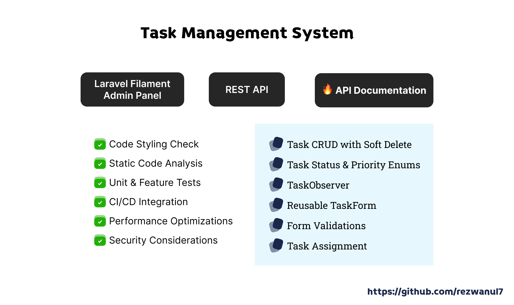

---

# Task Management System

This is a simple task management system that allows users to create, read, update, and delete tasks. The system is built
using Laravel Filament.

- [Live Demo](https://task-management.rezwan.xyz)
- [API Documentation](https://task-management.rezwan.xyz/docs)

---


### 🔥 Core Features & Best Practices

- ✅ **Tech Stack** – PHP, Laravel, Filament, SQLite/MySQL/PostgreSQL
- ✅ **Filament Admin Panel** – Modern UI for managing tasks
- ✅ **REST API** – Task CRUD operations
- ✅ **API Documentation** – Auto-generated with **Scribe**
- ✅ **Task CRUD with Soft Delete** – Full task lifecycle support
- ✅ **Task Status & Priority Enums** – Clean, maintainable enums
- ✅ **TaskObserver** – Automatically assigns `assign_by_id`
- ✅ **Reusable TaskForm** – Efficient form management
- ✅ **Form Validations** – Enforces business rules
- ✅ **Task Assignment** – Assign tasks to users

### 🚀 Code Quality & Deployment

- ✅ **Code Styling Check** – Used **Laravel Pint** for automated code styling
- ✅ **Static Code Analysis** – Used **Larastan** (PHPStan for Laravel)
- ✅ **Unit & Feature Tests** – Written using **Pest**, ensuring application reliability
- ✅ **Security Considerations** – CSRF protection, validation, authentication
- ✅ **Performance Optimizations** – Query optimization, caching, eager loading
- ✅ **CI/CD Integration** – Automated testing & deployment

---

## Todos

- [x] Task **CRUD** with **SoftDelete**
- [x] Assign a task to a user
- [x] **Reuseable** TaskForm
- [x] **Form Validation**
    - Ensure due time is not in the past
    - Ensure start time is before due time
    - Ensure end time is after start time
    - Ensure user exists in the database
- [x] **Enum** for **TaskStatus**, **TaskPriority**.
- [x] **HasDisplayAttributes Trait** for Enum to work with the label and color of the Task Status, Task Priority
- [x] Manage Label and Colors for Task Status, Task Priority mapping inside the Enum
- [x] Create **TaskObserver** to assign authenticated user id to assign_by_id field when creating a task

## Installation

Clone the repo locally:

```shell
git clone https://github.com/rezwanul7/task-management.git task-management && cd task-management
```

Install PHP dependencies:

```shell
composer install
```

Setup configuration:

```shell
cp .env.example .env
```

Generate application key:

```shell
php artisan key:generate
```

Create an SQLite database. You can also use another database (MySQL, Postgres), simply update your configuration
accordingly.

```shell
touch database/database.sqlite
```

Run database migrations:

```shell
php artisan migrate
```

Run database seeder:

```shell
php artisan db:seed
```

Create a symlink to the storage:

```sh
php artisan storage:link
```

Run the dev server (the output will give the address):

```sh
php artisan serve
```

You're ready to go! Visit the url in your browser, and login with:

- **Username:** admin@example.com
- **Password:** password

Generate Api Documentation:

```shell
php artisan scribe:generate
```

Preview the documentation by visiting the url displayed in the terminal.

## Code Styling

Check for linting issues:

```shell
./vendor/bin/pint --test
```

Automatically Fix linting issues :

```shell
./vendor/bin/pint -v
```

## Static Analysis

Run static code analysis:

```shell
./vendor/bin/phpstan analyse
```

## Testing

Run the tests:

```shell
php artisan test --env=testing
```
